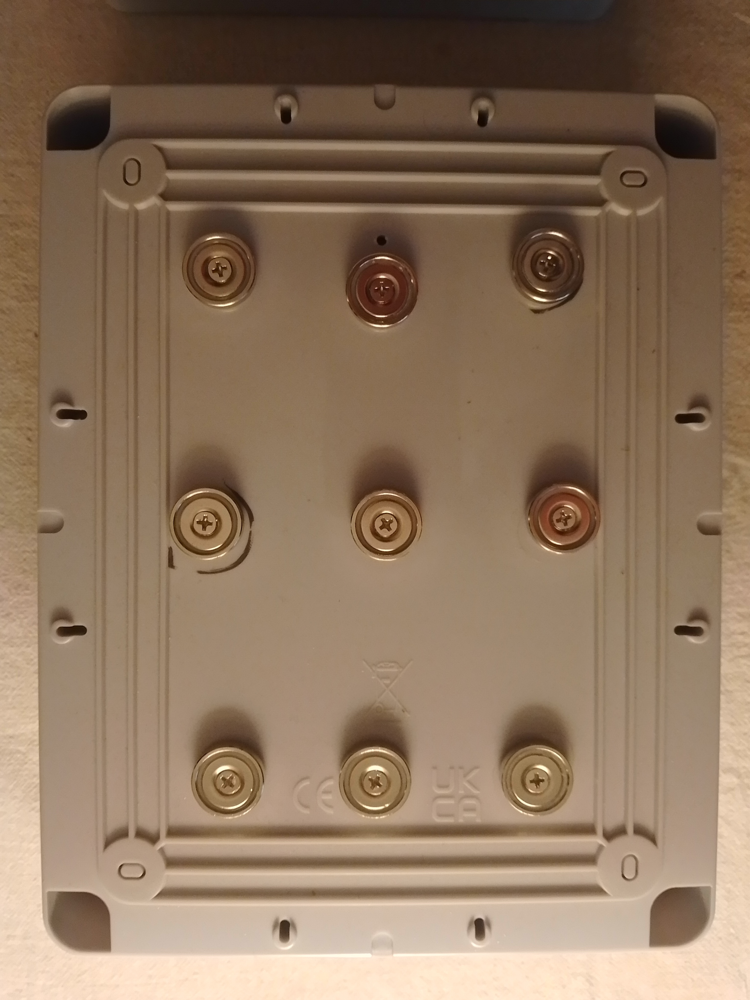
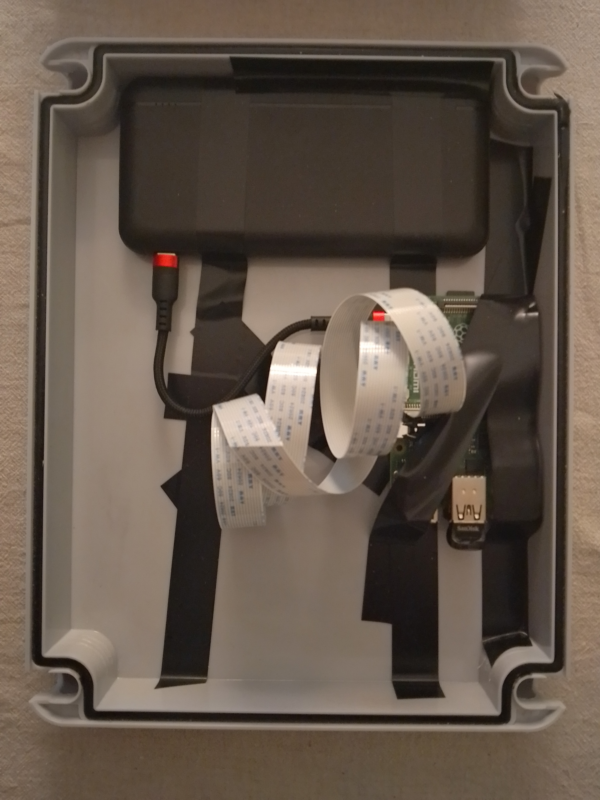
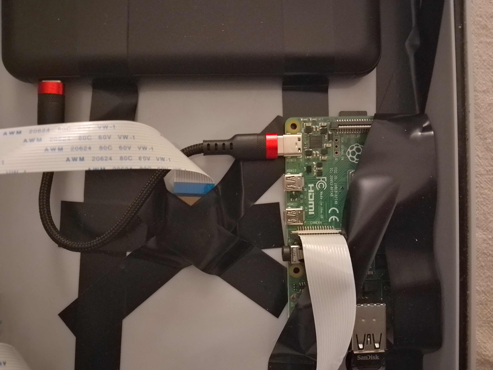

## CYCLIST COUNTER

This application will run on a Raspberry Pi and if you set your camera on a street or bikepath will keep a count of cyclists. It whole thing costs (2025) about £120 in parts:

- [Raspberry Pi 4b with 4GB RAM](https://thepihut.com/products/raspberry-pi-4-model-b), £52.50

- [Raspberry Pi camera module V2](https://thepihut.com/products/raspberry-pi-camera-module), £14.40

- [Battery pack](https://thepihut.com/products/ansmann-10-000mah-type-c-18w-pd-power-bank), £25.90
 
- [USB drive](https://thepihut.com/products/sandisk-ultra-fit-usb-3-1-flash-drive), 32GB, £8

- Short USB C-C cable, £3.34

- Neodymium magnets x 10, £9.99

- Junction Box with hinged lid. 240mm x 190mm x 90mm Waterproof, £10.50

It's in an outer box

  

with these insides

  

and this detail

  

## TRACKER

Once you've installed a Python virtual environment, the bytetracks file that is part of the Ultralytics library and that sets the parameters on the tracker can be found (on a mac) at: 

<your_virtual_env>/lib/python3.10/site-packages/ultralytics/cfg/trackers/bytetrack.yaml

We adjusted "track_high_thresh" to 0.5 and "new_track_thresh" to 0.6 which left the following parameters:

tracker_type: bytetrack 
track_high_thresh: 0.5 
track_low_thresh: 0.1 
new_track_thresh: 0.6 
track_buffer: 30  
match_thresh: 0.8  
fuse_score: True  

---

## USB

Saving to the Pi's external USB will require

csv_filename = "bicycle_log.csv"
usb_path = '/Volumes/data'
os.makedirs(usb_path, exist_ok=True)
csv_file_path = os.path.join(usb_path, csv_filename)
